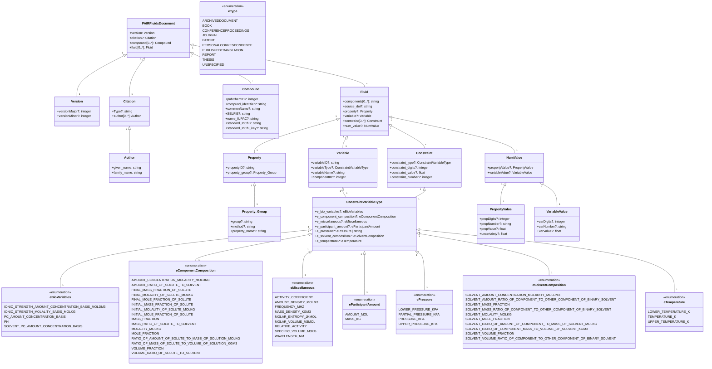

```mermaid
classDiagram
    %% Class definitions with attributes
    class FAIRFluidsDocument {
        +version: Version
        +citation?: Citation
        +compound[0..*]: Compound
        +fluid[0..*]: Fluid
    }

    class Version {
        +versionMajor?: integer
        +versionMinor?: integer
    }

    class Citation {
        +Type?: string
        +author[0..*]: Author
    }

    class Author {
        +given_name: string
        +family_name: string
    }

    class Compound {
        +pubChemID?: integer
        +compund_identifier?: string
        +commonName?: string
        +SELFIE?: string
        +name_IUPAC?: string
        +standard_InChI?: string
        +standard_InChI_key?: string
    }

    class Fluid {
        +components[0..*]: string
        +source_doi?: string
        +property?: Property
        +variable?: Variable
        +constraint[0..*]: Constraint
        +num_value?: NumValue
    }

    class Property {
        +propertyID?: string
        +property_group?: Property_Group
    }

    class Property_Group {
        +group?: string
        +method?: string
        +property_name?: string
    }

    class Variable {
        +variableID?: string
        +variableType?: ConstraintVariableType
        +variableName?: string
        +componentID?: integer
    }

    class Constraint {
        +constraint_type?: ConstraintVariableType
        +constraint_digits?: integer
        +constraint_value?: float
        +constraint_number?: integer
    }

    class ConstraintVariableType {
        +e_bio_variables?: eBioVariables
        +e_component_composition?: eComponentComposition
        +e_miscellaneous?: eMiscellaneous
        +e_participant_amount?: eParticipantAmount
        +e_pressure?: ePressure | string
        +e_solvent_composition?: eSolventComposition
        +e_temperature?: eTemperature
    }

    class NumValue {
        +propertyValue?: PropertyValue
        +variableValue?: VariableValue
    }

    class PropertyValue {
        +propDigits?: integer
        +propNumber?: string
        +propValue?: float
        +uncertainty?: float
    }

    class VariableValue {
        +varDigits?: integer
        +varNumber?: string
        +varValue?: float
    }

    %% Enum definitions
    class eType {
        <<enumeration>>
        ARCHIVEDDOCUMENT
        BOOK
        CONFERENCEPROCEEDINGS
        JOURNAL
        PATENT
        PERSONALCORRESPONDENCE
        PUBLISHEDTRANSLATION
        REPORT
        THESIS
        UNSPECIFIED
    }

    class eTemperature {
        <<enumeration>>
        LOWER_TEMPERATURE_K
        TEMPERATURE_K
        UPPER_TEMPERATURE_K
    }

    class ePressure {
        <<enumeration>>
        LOWER_PRESSURE_KPA
        PARTIAL_PRESSURE_KPA
        PRESSURE_KPA
        UPPER_PRESSURE_KPA
    }

    class eComponentComposition {
        <<enumeration>>
        AMOUNT_CONCENTRATION_MOLARITY_MOLDM3
        AMOUNT_RATIO_OF_SOLUTE_TO_SOLVENT
        FINAL_MASS_FRACTION_OF_SOLUTE
        FINAL_MOLALITY_OF_SOLUTE_MOLKG
        FINAL_MOLE_FRACTION_OF_SOLUTE
        INITIAL_MASS_FRACTION_OF_SOLUTE
        INITIAL_MOLALITY_OF_SOLUTE_MOLKG
        INITIAL_MOLE_FRACTION_OF_SOLUTE
        MASS_FRACTION
        MASS_RATIO_OF_SOLUTE_TO_SOLVENT
        MOLALITY_MOLKG
        MOLE_FRACTION
        RATIO_OF_AMOUNT_OF_SOLUTE_TO_MASS_OF_SOLUTION_MOLKG
        RATIO_OF_MASS_OF_SOLUTE_TO_VOLUME_OF_SOLUTION_KGM3
        VOLUME_FRACTION
        VOLUME_RATIO_OF_SOLUTE_TO_SOLVENT
    }

    class eSolventComposition {
        <<enumeration>>
        SOLVENT_AMOUNT_CONCENTRATION_MOLARITY_MOLDM3
        SOLVENT_AMOUNT_RATIO_OF_COMPONENT_TO_OTHER_COMPONENT_OF_BINARY_SOLVENT
        SOLVENT_MASS_FRACTION
        SOLVENT_MASS_RATIO_OF_COMPONENT_TO_OTHER_COMPONENT_OF_BINARY_SOLVENT
        SOLVENT_MOLALITY_MOLKG
        SOLVENT_MOLE_FRACTION
        SOLVENT_RATIO_OF_AMOUNT_OF_COMPONENT_TO_MASS_OF_SOLVENT_MOLKG
        SOLVENT_RATIO_OF_COMPONENT_MASS_TO_VOLUME_OF_SOLVENT_KGM3
        SOLVENT_VOLUME_FRACTION
        SOLVENT_VOLUME_RATIO_OF_COMPONENT_TO_OTHER_COMPONENT_OF_BINARY_SOLVENT
    }

    class eMiscellaneous {
        <<enumeration>>
        ACTIVITY_COEFFICIENT
        AMOUNT_DENSITY_MOLM3
        FREQUENCY_MHZ
        MASS_DENSITY_KGM3
        MOLAR_ENTROPY_JKMOL
        MOLAR_VOLUME_M3MOL
        RELATIVE_ACTIVITY
        SPECIFIC_VOLUME_M3KG
        WAVELENGTH_NM
    }

    class eBioVariables {
        <<enumeration>>
        IONIC_STRENGTH_AMOUNT_CONCENTRATION_BASIS_MOLDM3
        IONIC_STRENGTH_MOLALITY_BASIS_MOLKG
        PC_AMOUNT_CONCENTRATION_BASIS
        PH
        SOLVENT_PC_AMOUNT_CONCENTRATION_BASIS
    }

    class eParticipantAmount {
        <<enumeration>>
        AMOUNT_MOL
        MASS_KG
    }

    %% Relationships
    FAIRFluidsDocument "1" <|-- "1" Version
    FAIRFluidsDocument "1" <|-- "1" Citation
    FAIRFluidsDocument "1" <|-- "*" Compound
    FAIRFluidsDocument "1" <|-- "*" Fluid
    Citation "1" <|-- "*" Author
    Fluid "1" <|-- "1" Property
    Fluid "1" <|-- "1" Variable
    Fluid "1" <|-- "*" Constraint
    Fluid "1" <|-- "1" NumValue
    Property "1" <|-- "1" Property_Group
    Variable "1" <|-- "1" ConstraintVariableType
    Constraint "1" <|-- "1" ConstraintVariableType
    ConstraintVariableType "1" <|-- "1" eBioVariables
    ConstraintVariableType "1" <|-- "1" eComponentComposition
    ConstraintVariableType "1" <|-- "1" eMiscellaneous
    ConstraintVariableType "1" <|-- "1" eParticipantAmount
    ConstraintVariableType "1" <|-- "1" ePressure
    ConstraintVariableType "1" <|-- "1" eSolventComposition
    ConstraintVariableType "1" <|-- "1" eTemperature
    NumValue "1" <|-- "1" PropertyValue
    NumValue "1" <|-- "1" VariableValue
```