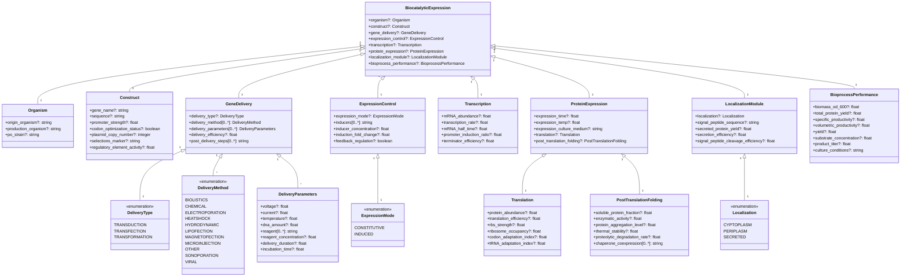

```mermaid
classDiagram
    %% Class definitions with attributes
    class BiocatalyticExpression {
        +organism?: Organism
        +construct?: Construct
        +gene_delivery?: GeneDelivery
        +expression_control?: ExpressionControl
        +transcription?: Transcription
        +protein_expression?: ProteinExpression
        +localization_module?: LocalizationModule
        +bioprocess_performance?: BioprocessPerformance
    }

    class Organism {
        +origin_organism?: string
        +production_organism?: string
        +po_strain?: string
    }

    class Construct {
        +gene_name?: string
        +sequence?: string
        +promoter_strength?: float
        +codon_optimization_status?: boolean
        +plasmid_copy_number?: integer
        +selections_marker?: string
        +regulatory_element_activity?: float
    }

    class GeneDelivery {
        +delivery_type?: DeliveryType
        +delivery_method[0..*]: DeliveryMethod
        +delivery_parameters[0..*]: DeliveryParameters
        +delivery_efficiency?: float
        +post_delivery_steps[0..*]: string
    }

    class DeliveryParameters {
        +voltage?: float
        +current?: float
        +temperature?: float
        +dna_amount?: float
        +reagent[0..*]: string
        +reagent_concentration?: float
        +delivery_duration?: float
        +incubation_time?: float
    }

    class ExpressionControl {
        +expression_mode?: ExpressionMode
        +inducers[0..*]: string
        +inducer_concentration?: float
        +induction_fold_change?: float
        +feedback_regulation?: boolean
    }

    class Transcription {
        +mRNA_abundance?: float
        +transcription_rate?: float
        +mRNA_half_time?: float
        +promoter_induction_ratio?: float
        +terminator_efficiency?: float
    }

    class ProteinExpression {
        +expression_time?: float
        +expression_temp?: float
        +expression_culture_medium?: string
        +translation?: Translation
        +post_translation_folding?: PostTranslationFolding
    }

    class Translation {
        +protein_abundance?: float
        +translation_efficiency?: float
        +rbs_strength?: float
        +ribosome_occupancy?: float
        +codon_adaptation_index?: float
        +tRNA_adaptation_index?: float
    }

    class PostTranslationFolding {
        +soluble_protein_fraction?: float
        +enzymatic_activity?: float
        +protein_aggregation_level?: float
        +thermal_stability?: float
        +proteolytic_degradation_rate?: float
        +chaperone_coexpression[0..*]: string
    }

    class LocalizationModule {
        +localization?: Localization
        +signal_peptide_sequence?: string
        +secreted_protein_yield?: float
        +secretion_efficiency?: float
        +signal_peptide_cleavage_efficiency?: float
    }

    class BioprocessPerformance {
        +biomass_od_600?: float
        +total_protein_yield?: float
        +specific_productivity?: float
        +volumetric_productivity?: float
        +yield?: float
        +substrate_concentration?: float
        +product_titer?: float
        +culture_conditions?: string
    }

    %% Enum definitions
    class ExpressionMode {
        <<enumeration>>
        CONSTITUTIVE
        INDUCED
    }

    class DeliveryType {
        <<enumeration>>
        TRANSDUCTION
        TRANSFECTION
        TRANSFORMATION
    }

    class DeliveryMethod {
        <<enumeration>>
        BIOLISTICS
        CHEMICAL
        ELECTROPORATION
        HEATSHOCK
        HYDRODYNAMIC
        LIPOFECTION
        MAGNETOFECTION
        MICROINJECTION
        OTHER
        SONOPORATION
        VIRAL
    }

    class Localization {
        <<enumeration>>
        CYPTOPLASM
        PERIPLASM
        SECRETED
    }

    %% Relationships
    BiocatalyticExpression "1" <|-- "1" Organism
    BiocatalyticExpression "1" <|-- "1" Construct
    BiocatalyticExpression "1" <|-- "1" GeneDelivery
    BiocatalyticExpression "1" <|-- "1" ExpressionControl
    BiocatalyticExpression "1" <|-- "1" Transcription
    BiocatalyticExpression "1" <|-- "1" ProteinExpression
    BiocatalyticExpression "1" <|-- "1" LocalizationModule
    BiocatalyticExpression "1" <|-- "1" BioprocessPerformance
    GeneDelivery "1" <|-- "1" DeliveryType
    GeneDelivery "1" <|-- "*" DeliveryMethod
    GeneDelivery "1" <|-- "*" DeliveryParameters
    ExpressionControl "1" <|-- "1" ExpressionMode
    ProteinExpression "1" <|-- "1" Translation
    ProteinExpression "1" <|-- "1" PostTranslationFolding
    LocalizationModule "1" <|-- "1" Localization
```