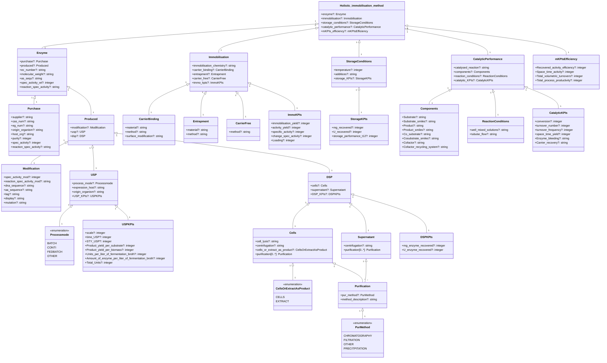

```mermaid
classDiagram
    %% Class definitions with attributes
    class Holistic_immobilisation_method {
        +enzyme?: Enzyme
        +immobilisation?: Immobilisation
        +storage_conditions?: StorageConditions
        +catalytic_performance?: CatalyticPerformance
        +mKPIs_efficiency?: mKPIsEfficiency
    }

    class Enzyme {
        +purchase?: Purchase
        +produced?: Produced
        +ec_number?: string
        +molecular_weight?: string
        +as_sequ?: string
        +spec_activity_wt?: integer
        +reaction_spec_activity?: string
    }

    class Purchase {
        +supplier?: string
        +cas_num?: string
        +eg_num?: string
        +origin_organism?: string
        +host_org?: string
        +purity?: integer
        +spec_activity?: integer
        +reaction_spec_activity?: string
    }

    class Produced {
        +modification?: Modification
        +usp?: USP
        +dsp?: DSP
    }

    class Modification {
        +spec_activity_mod?: integer
        +reaction_spec_activity_mod?: string
        +dna_sequence?: string
        +aa_sequence?: string
        +tag?: string
        +display?: string
        +mutation?: string
    }

    class USP {
        +process_mode?: Processmode
        +expression_host?: string
        +origin_organism?: string
        +USP_KPIs?: USPKPIs
    }

    class USPKPIs {
        +scale?: integer
        +time_USP?: integer
        +STY_USP?: integer
        +Product_yield_per_substrate?: integer
        +Product_yield_per_biomass?: integer
        +Units_per_liter_of_fermentation_broth?: integer
        +Amount_of_enzyme_per_liter_of_fermentation_broth?: integer
        +Total_Units?: integer
    }

    class DSP {
        +cells?: Cells
        +supernatant?: Supernatant
        +DSP_KPIs?: DSPKPIs
    }

    class Cells {
        +cell_lysis?: string
        +centrifugation?: string
        +cells_or_extract_as_product?: CellsOrExtractAsProduct
        +purification[0..*]: Purification
    }

    class Supernatant {
        +centrifugation?: string
        +purification[0..*]: Purification
    }

    class Purification {
        +pur_method?: PurMethod
        +method_description?: string
    }

    class DSPKPIs {
        +mg_enzyme_recovered?: integer
        +U_enzyme_recovered?: integer
    }

    class Immobilisation {
        +immobilisation_chemistry?: string
        +carrier_binding?: CarrierBinding
        +entrapment?: Entrapment
        +carrier_free?: CarrierFree
        +immo_kpis?: ImmoKPIs
    }

    class CarrierBinding {
        +material?: string
        +method?: string
        +surface_modification?: string
    }

    class Entrapment {
        +material?: string
        +method?: string
    }

    class CarrierFree {
        +method?: string
    }

    class ImmoKPIs {
        +immobilisation_yield?: integer
        +activity_yield?: integer
        +specific_activity?: integer
        +change_spec_activity?: integer
        +Loading?: integer
    }

    class StorageConditions {
        +temperature?: integer
        +additices?: string
        +storage_KPIs?: StorageKPIs
    }

    class StorageKPIs {
        +mg_recovered?: integer
        +U_recovered?: integer
        +storage_performance_t12?: integer
    }

    class CatalyticPerformance {
        +catalysed_reaction?: string
        +components?: Components
        +reaction_conditions?: ReactionConditions
        +catalytic_KPIs?: CatalyticKPIs
    }

    class Components {
        +Substrate?: string
        +Substrate_smiles?: string
        +Product?: string
        +Product_smiles?: string
        +Co_substrate?: string
        +Cosubstrate_smiles?: string
        +Cofactor?: string
        +Cofactor_recycling_system?: string
    }

    class ReactionConditions {
        +well_mixed_solutions?: string
        +tubular_flow?: string
    }

    class CatalyticKPIs {
        +conversion?: integer
        +turnover_number?: integer
        +turnover_frequency?: integer
        +space_time_yield?: integer
        +Enzyme_bleeding?: string
        +Carrier_recovery?: string
    }

    class mKPIsEfficiency {
        +Recovered_activity_efficiency?: integer
        +Space_time_activity?: integer
        +Total_volumetric_turnovers?: integer
        +Total_process_productivity?: integer
    }

    %% Enum definitions
    class Processmode {
        <<enumeration>>
        BATCH
        CONTI
        FEDBATCH
        OTHER
    }

    class PurMethod {
        <<enumeration>>
        CHROMATOGRAPHY
        FILTRATION
        OTHER
        PRECITPITATION
    }

    class CellsOrExtractAsProduct {
        <<enumeration>>
        CELLS
        EXTRACT
    }

    %% Relationships
    Holistic_immobilisation_method "1" <|-- "1" Enzyme
    Holistic_immobilisation_method "1" <|-- "1" Immobilisation
    Holistic_immobilisation_method "1" <|-- "1" StorageConditions
    Holistic_immobilisation_method "1" <|-- "1" CatalyticPerformance
    Holistic_immobilisation_method "1" <|-- "1" mKPIsEfficiency
    Enzyme "1" <|-- "1" Purchase
    Enzyme "1" <|-- "1" Produced
    Produced "1" <|-- "1" Modification
    Produced "1" <|-- "1" USP
    Produced "1" <|-- "1" DSP
    USP "1" <|-- "1" Processmode
    USP "1" <|-- "1" USPKPIs
    DSP "1" <|-- "1" Cells
    DSP "1" <|-- "1" Supernatant
    DSP "1" <|-- "1" DSPKPIs
    Cells "1" <|-- "1" CellsOrExtractAsProduct
    Cells "1" <|-- "*" Purification
    Supernatant "1" <|-- "*" Purification
    Purification "1" <|-- "1" PurMethod
    Immobilisation "1" <|-- "1" CarrierBinding
    Immobilisation "1" <|-- "1" Entrapment
    Immobilisation "1" <|-- "1" CarrierFree
    Immobilisation "1" <|-- "1" ImmoKPIs
    StorageConditions "1" <|-- "1" StorageKPIs
    CatalyticPerformance "1" <|-- "1" Components
    CatalyticPerformance "1" <|-- "1" ReactionConditions
    CatalyticPerformance "1" <|-- "1" CatalyticKPIs
```