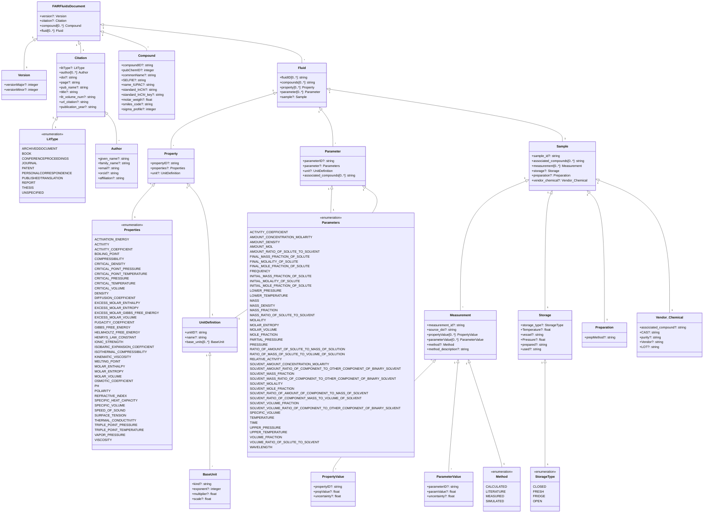

```mermaid
classDiagram
    %% Class definitions with attributes
    class FAIRFluidsDocument {
        +version?: Version
        +citation?: Citation
        +compound[0..*]: Compound
        +fluid[0..*]: Fluid
    }

    class Version {
        +versionMajor?: integer
        +versionMinor?: integer
    }

    class Citation {
        +litType?: LitType
        +author[0..*]: Author
        +doi?: string
        +page?: string
        +pub_name?: string
        +title?: string
        +lit_volume_num?: string
        +url_citation?: string
        +publication_year?: string
    }

    class Author {
        +given_name?: string
        +family_name?: string
        +email?: string
        +orcid?: string
        +affiliation?: string
    }

    class Compound {
        +compoundID?: string
        +pubChemID?: integer
        +commonName?: string
        +SELFIE?: string
        +name_IUPAC?: string
        +standard_InChI?: string
        +standard_InChI_key?: string
        +molar_weigth?: float
        +smiles_code?: string
        +sigma_profile?: integer
    }

    class Fluid {
        +fluidID[0..*]: string
        +compounds[0..*]: string
        +property[0..*]: Property
        +parameter[0..*]: Parameter
        +sample?: Sample
    }

    class Property {
        +propertyID?: string
        +properties?: Properties
        +unit?: UnitDefinition
    }

    class Parameter {
        +parameterID?: string
        +parameter?: Parameters
        +unit?: UnitDefinition
        +associated_compounds[0..*]: string
    }

    class Measurement {
        +measurement_id?: string
        +source_doi?: string
        +propertyValue[0..*]: PropertyValue
        +parameterValue[0..*]: ParameterValue
        +method?: Method
        +method_description?: string
    }

    class Sample {
        +sample_id?: string
        +associated_compounds[0..*]: string
        +measurement[0..*]: Measurement
        +storage?: Storage
        +preparation?: Preparation
        +vendor_chemical?: Vendor_Chemical
    }

    class Preparation {
        +prepMethod?: string
    }

    class PropertyValue {
        +propertyID?: string
        +propValue?: float
        +uncertainty?: float
    }

    class ParameterValue {
        +parameterID?: string
        +paramValue?: float
        +uncertainty?: float
    }

    class UnitDefinition {
        +unitID?: string
        +name?: string
        +base_units[0..*]: BaseUnit
    }

    class BaseUnit {
        +kind?: string
        +exponent?: integer
        +multiplier?: float
        +scale?: float
    }

    class Storage {
        +storage_type?: StorageType
        +Temperature?: float
        +vessel?: string
        +Pressure?: float
        +prepared?: string
        +used?: string
    }

    class Vendor_Chemical {
        +assciciated_compound?: string
        +CAS?: string
        +purity?: string
        +Vendor?: string
        +LOT?: string
    }

    %% Enum definitions
    class LitType {
        <<enumeration>>
        ARCHIVEDDOCUMENT
        BOOK
        CONFERENCEPROCEEDINGS
        JOURNAL
        PATENT
        PERSONALCORRESPONDENCE
        PUBLISHEDTRANSLATION
        REPORT
        THESIS
        UNSPECIFIED
    }

    class Method {
        <<enumeration>>
        CALCULATED
        LITERATURE
        MEASURED
        SIMULATED
    }

    class Properties {
        <<enumeration>>
        ACTIVATION_ENERGY
        ACTIVITY
        ACTIVITY_COEFFICIENT
        BOILING_POINT
        COMPRESSIBILITY
        CRITICAL_DENSITY
        CRITICAL_POINT_PRESSURE
        CRITICAL_POINT_TEMPERATURE
        CRITICAL_PRESSURE
        CRITICAL_TEMPERATURE
        CRITICAL_VOLUME
        DENSITY
        DIFFUSION_COEFFICIENT
        EXCESS_MOLAR_ENTHALPY
        EXCESS_MOLAR_ENTROPY
        EXCESS_MOLAR_GIBBS_FREE_ENERGY
        EXCESS_MOLAR_VOLUME
        FUGACITY_COEFFICIENT
        GIBBS_FREE_ENERGY
        HELMHOLTZ_FREE_ENERGY
        HENRYS_LAW_CONSTANT
        IONIC_STRENGTH
        ISOBARIC_EXPANSION_COEFFICIENT
        ISOTHERMAL_COMPRESSIBILITY
        KINEMATIC_VISCOSITY
        MELTING_POINT
        MOLAR_ENTHALPY
        MOLAR_ENTROPY
        MOLAR_VOLUME
        OSMOTIC_COEFFICIENT
        PH
        POLARITY
        REFRACTIVE_INDEX
        SPECIFIC_HEAT_CAPACITY
        SPECIFIC_VOLUME
        SPEED_OF_SOUND
        SURFACE_TENSION
        THERMAL_CONDUCTIVITY
        TRIPLE_POINT_PRESSURE
        TRIPLE_POINT_TEMPERATURE
        VAPOR_PRESSURE
        VISCOSITY
    }

    class Parameters {
        <<enumeration>>
        ACTIVITY_COEFFICIENT
        AMOUNT_CONCENTRATION_MOLARITY
        AMOUNT_DENSITY
        AMOUNT_MOL
        AMOUNT_RATIO_OF_SOLUTE_TO_SOLVENT
        FINAL_MASS_FRACTION_OF_SOLUTE
        FINAL_MOLALITY_OF_SOLUTE
        FINAL_MOLE_FRACTION_OF_SOLUTE
        FREQUENCY
        INITIAL_MASS_FRACTION_OF_SOLUTE
        INITIAL_MOLALITY_OF_SOLUTE
        INITIAL_MOLE_FRACTION_OF_SOLUTE
        LOWER_PRESSURE
        LOWER_TEMPERATURE
        MASS
        MASS_DENSITY
        MASS_FRACTION
        MASS_RATIO_OF_SOLUTE_TO_SOLVENT
        MOLALITY
        MOLAR_ENTROPY
        MOLAR_VOLUME
        MOLE_FRACTION
        PARTIAL_PRESSURE
        PRESSURE
        RATIO_OF_AMOUNT_OF_SOLUTE_TO_MASS_OF_SOLUTION
        RATIO_OF_MASS_OF_SOLUTE_TO_VOLUME_OF_SOLUTION
        RELATIVE_ACTIVITY
        SOLVENT_AMOUNT_CONCENTRATION_MOLARITY
        SOLVENT_AMOUNT_RATIO_OF_COMPONENT_TO_OTHER_COMPONENT_OF_BINARY_SOLVENT
        SOLVENT_MASS_FRACTION
        SOLVENT_MASS_RATIO_OF_COMPONENT_TO_OTHER_COMPONENT_OF_BINARY_SOLVENT
        SOLVENT_MOLALITY
        SOLVENT_MOLE_FRACTION
        SOLVENT_RATIO_OF_AMOUNT_OF_COMPONENT_TO_MASS_OF_SOLVENT
        SOLVENT_RATIO_OF_COMPONENT_MASS_TO_VOLUME_OF_SOLVENT
        SOLVENT_VOLUME_FRACTION
        SOLVENT_VOLUME_RATIO_OF_COMPONENT_TO_OTHER_COMPONENT_OF_BINARY_SOLVENT
        SPECIFIC_VOLUME
        TEMPERATURE
        TIME
        UPPER_PRESSURE
        UPPER_TEMPERATURE
        VOLUME_FRACTION
        VOLUME_RATIO_OF_SOLUTE_TO_SOLVENT
        WAVELENGTH
    }

    class StorageType {
        <<enumeration>>
        CLOSED
        FRESH
        FRIDGE
        OPEN
    }

    %% Relationships
    FAIRFluidsDocument "1" <|-- "1" Version
    FAIRFluidsDocument "1" <|-- "1" Citation
    FAIRFluidsDocument "1" <|-- "*" Compound
    FAIRFluidsDocument "1" <|-- "*" Fluid
    Citation "1" <|-- "1" LitType
    Citation "1" <|-- "*" Author
    Fluid "1" <|-- "*" Property
    Fluid "1" <|-- "*" Parameter
    Fluid "1" <|-- "1" Sample
    Property "1" <|-- "1" Properties
    Property "1" <|-- "1" UnitDefinition
    Parameter "1" <|-- "1" Parameters
    Parameter "1" <|-- "1" UnitDefinition
    Measurement "1" <|-- "*" PropertyValue
    Measurement "1" <|-- "*" ParameterValue
    Measurement "1" <|-- "1" Method
    Sample "1" <|-- "*" Measurement
    Sample "1" <|-- "1" Storage
    Sample "1" <|-- "1" Preparation
    Sample "1" <|-- "1" Vendor_Chemical
    UnitDefinition "1" <|-- "*" BaseUnit
    Storage "1" <|-- "1" StorageType
```